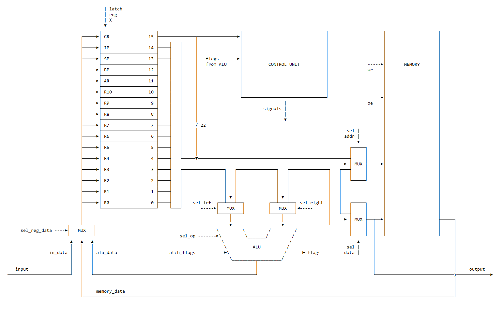
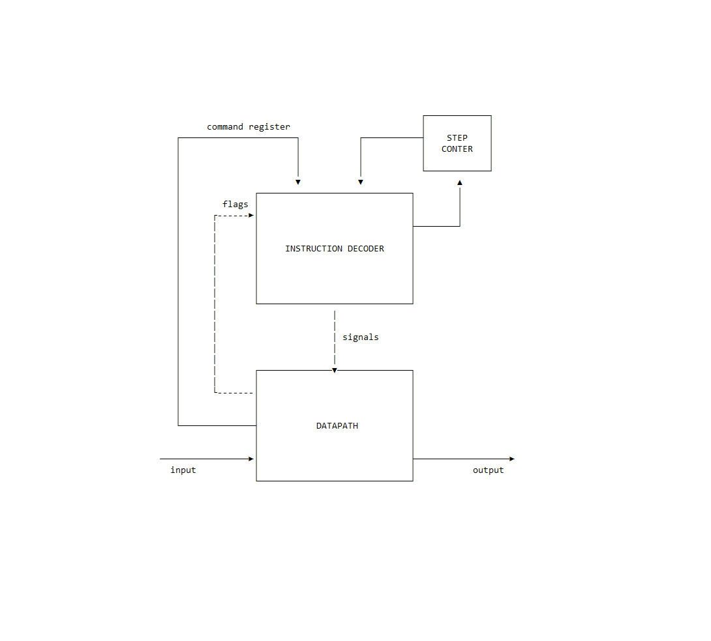

# Simple RISC asm & model

- P3217, Бутов Иван Алексеевич.
- `alg -> asm | risc | neum | hw | instr | binary -> struct | stream | port | pstr | prob2 | cache`
- Упрощенный вариант.


## Язык программирования Asm

Синтаксис в расширенной БНФ.

- `[ ... ]` -- вхождение 0 или 1 раз
- `{ ... }` -- повторение 0 или несколько раз
- `{ ... }-` -- повторение 1 или несколько раз

``` ebnf
program ::= { instr }

instr ::= [label] oper
        | [label] mem_alloc
        | comment

label ::= label_name ':'

oper ::= op0
       | op1 reg
       | op1 data        
       | op2 reg reg
       | op2 reg data

op0 ::= "hlt"
      | "ret"

op1 ::= "call"
      | "jmp"
      | "jz" | "jnz" | "jl" | "jg"
      | "pop" | "push"
      
op2 ::= "cmp"
      | "st" | "ld"
      | "in" | "out"
      | "mv"
      | "add" | "sub" | "mul" | "div" | "rem"

reg ::= "r0" | "r1" | "r2" | "r3"
      | "r4" | "r5" | "r6" | "r7"
      | "r8" | "r9" | "r10"| "ar"
      | "bp" | "sp"

data ::= integer 
       | label_name 

mem_alloc ::= integer
            | alloc
            | string

alloc ::= '[' number ']'

string ::= '"' <any ASCII chars> '"' 

integer ::= [ '-' ] number 

number ::= <any of "0-9"> { <any of "0-9"> }

label_name ::= <any of "a-z A-Z _"> { <any of "a-z A-Z 0-9 _"> }

comment ::= "#" [<any symbols except '\n'>]
```
Все операции напрямую кодируются в команды процессора, их описание  [см. в системе команд](#Система-команд).

Поддерживаются однострочные комментарии, начинающиеся с `#`.

Есть поддержка  меток. Метки должны быть уникальны в пределах файла. Парсер поставит на место использования метки адрес той инструкции, перед которой она определена.

Три способа выделения памяти:
 - `integer` - в ячейку по заданному адресу поместить 32 битное знаковое число;
 - `alloc` - выделить в памяти последовательность из `n` ячеек, инициализируются 0;
 - `string` - выделить в памяти последовательность и `len(string) + 1` ячеек. В первую положить длину строки, остальные заполнить кодами символов.

 Три вида операндов:
 - `reg` - указание на используемый регистр. Первый из двух возможных операндов всегда является регистром. `Command Register` и `Instruction Pointer` не могут быть напрямую модифицированы из  ассемблера, поскольку они определяют поток исполнения программы. 
 - `integer` -  `implicit` операнд, 22 битное знаковое число;
 - `label_name` - `implicit` операнд,  имя метки будет заменено на 22 битный адрес последующей инструкции.


## Организация памяти

Доступно 16 регистров по 32 бита:
 - `r0` - `r10` - регистры общего назначения;
 - `ar` - регистр адреса для реализации относительной адресации, может использоваться как регистр общего назначения;
 - `bp` - base pointer, используется при работе с функциями, `calle-saved` регистр;
 - `sp` - stack pointer, указатель на вершину стека, используется при работе с функциями, `calle-saved` регистр;
 - `ip` - указатель на следующую инструкцию, напрямую недоступен из ассемблера;
 - `cr` - регистр команды, подается в `Control Unit`, младшие 22 бита используются как `implicit` операнд, напрямую недоступен из ассемблера.

Память одна для инструкций и для данных, линейное адресное пространство, состоит из ячеек по 32 бита.
В модели память реализуется списком объектов `Command`, которые могут хранить данные или инструкции.

Размещение инструкций и данных в памяти определяет программист, память по итогу состоит из последовательности блоков инструкций и блоков данных. 


## Система команд

Особенности процессора:

- Машинное слово -- 32 бита
- Поток управления:
    - чтение инструкции по адресу `IP` в `CR` -- 1 такт;
    - инкремент `IP` -- всегда содержит адрес следующей инструкции -- 1 такт;
    - декодирование команды и выставление сигналов от `Control Unit`
	    - количество тактов указано в таблице

### Набор инструкций

|Инстр |Операнд 1     |Операнд 2     |Тактов |Описание                                                  |
|:----:|:-------------|:-------------|:-----:|:---------------------------------------------------------|
|`hlt` | -            |-             |1      | Останов |
|`ret` | -            |-             |5      | `sp <- bp`, `pop bp`, `pop ip` |
|`call`| -            |func_addr     |6      | `push ip`, `push bp`, `bp <- sp`, `jmp func_addr`|
|`cmp` | op1          |op2           |1      | Установить флаги по результату op1 - op2 |
|`jmp` | -            |addr          |1      | `ip <- addr` |
|`jz`  | -            |addr          |1      | `ip <- addr`, если `zero` == 1 |
|`jnz` | -            |addr          |1      | `ip <- addr`, если `zero` == 0 |
|`jl`  | -            |addr          |1      | `ip <- addr`, если `zero` == 0 и `sign` == `overflow` |
|`jg`  | -            |addr          |1      | `ip <- addr`, если `sign` != `overflow` |
|`st`  | reg data     |dest addr     |1      | `mem[op2] <- op1` |
|`ld`  | dest reg     |sourse addr   |1      | `op1 <- mem[op2]` |
|`pop` | -            |dest(reg only)|2      | `op2 <- mem[sp], sp <- sp + 1` |
|`push`| -            |data          |2      | `sp <- sp - 1, mem[sp] <- op2` |
|`in`  | dest reg     |in addr       |1      | `op1 <- input` |
|`out` | reg data     |out addr      |1      | `output <- op1` |
|`mv`  | op1 (dest)   |op2           |1      | `op1 <- op2` |
|`add` | op1 (dest)   |op2           |1      | `op1 <- op1 + op2` |
|`sub` | op1 (dest)   |op2           |1      | `op1 <- op1 - op2`|
|`mul` | op1 (dest)   |op2           |1      | `op1 <- op1 * op2`|
|`div` | op1 (dest)   |op2           |1      | `op1 <- op1 // op2` |
|`rem` | op1 (dest)   |op2           |1      | `op1 <- op1 % op2` |


### Кодирование инструкций

- Машинный код сериализуется в список JSON.
- Один элемент списка -- одна ячейка памяти, содержащая инструкцию или данные.
- Индекс списка -- адрес в памяти. Используется для команд перехода.

Пример:
```json
[
    {
	    "opcode": 16, 
	    "r1": 0, 
	    "r2": 15, 
	    "data": 14, 
	    "label": "name"
	  }
]
```

где:
- `opcode` -- опкод инструкции из перечисления `Opcodes`;
- `r1`, `r2` -- номера регистров из перечисления `Registers`;
- `data` -- поле для хранения данных при задании ячейки памяти или место для `implicit` операнда;
- `label` -- имя метки, проставленное при трансляции. Сохраняется для удобства отслеживания кода в модели.


Представление инструкции в бинарном виде:
`ocode|i|_r1_|_r2_|xxxxxxxxxxxxxxxxxx|` -- команда, где `i` == 0, второй операнд тоже является регистром;
`ocode|i|_r1_|_________data_________|` -- где `i` == 1, имеется `implicit` операнд.


Всего 32 бита:
- `ocode` -- код операции, 5 бит
- `i` -- флаг `implicit`, 1 бит
- `_r1_` -- первый регистр, 4 бита
	- `_r2_` -- второй регистр, 4 бита, оставшиеся 18 бит не используются
	- `data` -- место для `implicit` операнда, 22 бита


## Транслятор
Состоит из двух модулей: 

 - [`tokenizer`](./tokenizer.py) - переводит набор символов в токены, игнорирует лишние пробельные символы и комментарии;
 - [`parser`](./parser.py) - распознает инструкции в последовательности токенов и проставляет адреса меток за второй проход.

Интерфейс командной строки: `parser.py <input_file> <target_file>`


## Модель процессора

Интерфейс командной строки: `machine.py <machine_code_file> <input_file>`

Реализовано в модуле: [machine](./machine.py).

### DataPath



Реализован в классе `DataPath`.

Сигналы (обрабатываются за один такт, реализованы в виде методов класса):
- `latch_reg_alu_data` -- защёлкнуть в регистр результат операции АЛУ;
- `latch_reg_mem_data` -- прочитать значение из памяти и защелкнуть в регистр;
- `latch_reg_in_data` (обработка на Python):
        - извлечь из входного буфера значение и защелкнуть в регистр;
        - если буфер пуст -- выбросить исключение;
- `mem_wr` -- записать значение из регистра в память по указанному адресу;
- `output` -- записать значение из регистра в порт вывода (обработка на Python).

Флаги:
- `zero` -- устанавливается, если результат операции АЛУ равен нулю;
- `sign` -- устанавливается, если результат операции АЛУ отрицателен;
- `overflow` -- устанавливается, если при выполнении операции в АЛУ произошло переполнение (знаковые числа).


### ControlUnit



Реализован в классе `ControlUnit`.

- Hardwired (реализовано полностью на Python);
- Метод `decode_and_execute_instruction` моделирует выполнение полного цикла инструкции;
- `step_counter` необходим для многотактовых инструкций;
    - в реализации класс `ControlUnit` отсутствует, т.к. неявно задан потоком управления.

Поток управления:
- чтение инструкции по адресу `IP` в `CR` -- 1 такт;
- инкремент `IP` -- всегда содержит адрес следующей инструкции -- 1 такт;
- декодирование команды и выставление сигналов от `Control Unit`.

Особенности работы модели:
- Цикл симуляции осуществляется в функции `simulation`.
- Шаг моделирования соответствует одной инструкции с выводом состояния в журнал.
- Для журнала состояний процессора используется стандартный модуль `logging`.
- Количество инструкций для моделирования лимитировано.
- Остановка моделирования осуществляется при:
    - превышении лимита количества выполняемых инструкций;
    - исключении `EOFError` -- если нет данных для чтения из порта ввода;
    - исключении `StopIteration` -- если выполнена инструкция `halt`.

## Тестирование

Тестирование выполняется при помощи golden test-ов.

Тесты реализованы в: [golden_test](./golden_test.py). Конфигурации:
- [tests/cat.yml](tests/cat.yml)
- [tests/hello.ymll](tests/hello.yml)
- [tests/hello_user.ymll](tests/hello_user.yml)
- [tests/prob2.ymll](tests/prob2.yml)

Запустить тесты: `poetry run pytest . -v`

Обновить конфигурацию golden tests:  `poetry run pytest . -v --update-goldens`

CI при помощи Github Action:

``` yaml
name: Python CI  
  
on:  
  push:  
    branches:  
      - main  
    paths:  
      - "*.py"  
  - "tests/*.yml"  
  - ".github/workflows/python.yaml"  
  
  pull_request:  
    branches:  
      - main  
    paths:  
      - "*.py"  
  - "tests/*.yml"  
  - ".github/workflows/python.yaml"  
  
defaults:  
  run:  
    working-directory: ./  
  
jobs:  
  test:  
    runs-on: ubuntu-latest  
  
    steps:  
      - name: Checkout code  
        uses: actions/checkout@v4  
  
      - name: Set up Python  
        uses: actions/setup-python@v4  
        with:  
          python-version: 3.11  
  
      - name: Install dependencies  
        run: |  
          python -m pip install --upgrade pip  
          pip install poetry  
          poetry install  
  
      - name: Run tests and collect coverage  
        run: |  
          poetry run coverage run -m pytest .  
          poetry run coverage report -m  
        env:  
          CI: true  
  
  lint:  
    runs-on: ubuntu-latest  
  
    steps:  
      - name: Checkout code  
        uses: actions/checkout@v4  
  
      - name: Set up Python  
        uses: actions/setup-python@v4  
        with:  
          python-version: 3.11  
  
      - name: Install dependencies  
        run: |  
          python -m pip install --upgrade pip  
          pip install poetry  
          poetry install  
  
      - name: Check code formatting with Ruff  
        run: poetry run ruff format --check .  
  
      - name: Run Ruff linters  
        run: poetry run ruff check .
```

где:

- `poetry` -- управления зависимостями для языка программирования Python.
- `coverage` -- формирование отчёта об уровне покрытия исходного кода.
- `pytest` -- утилита для запуска тестов.
- `ruff` -- утилита для форматирования и проверки стиля кодирования.


