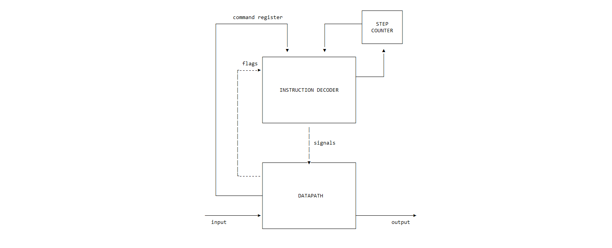

# Simple RISC asm & model

- P3217, Бутов Иван Алексеевич.
- `alg -> asm | risc | neum | hw | instr | binary -> struct | stream | port | pstr | prob2 | cache`
- Упрощенный вариант.


## Язык программирования Asm

Синтаксис в расширенной БНФ.

- `[ ... ]` -- вхождение 0 или 1 раз
- `{ ... }` -- повторение 0 или несколько раз
- `{ ... }-` -- повторение 1 или несколько раз

``` ebnf
program ::= { instr }

instr ::= [label] oper
        | [label] mem_alloc
        | comment

label ::= label_name ':'

oper ::= op0
       | op1 reg
       | op1 data        
       | op2 reg reg
       | op2 reg data

op0 ::= "hlt"
      | "ret"

op1 ::= "call"
      | "jmp"
      | "jz" | "jnz" | "jl" | "jg"
      | "pop" | "push"
      
op2 ::= "cmp"
      | "st" | "ld"
      | "in" | "out"
      | "mv"
      | "add" | "sub" | "mul" | "div" | "rem"

reg ::= "r0" | "r1" | "r2" | "r3"
      | "r4" | "r5" | "r6" | "r7"
      | "r8" | "r9" | "r10"| "ar"
      | "bp" | "sp"

data ::= integer 
       | label_name 

mem_alloc ::= integer
            | alloc
            | string

alloc ::= '[' number ']'

string ::= '"' <any ASCII chars> '"' 

integer ::= [ '-' ] number 

number ::= <any of "0-9"> { <any of "0-9"> }

label_name ::= <any of "a-z A-Z _"> { <any of "a-z A-Z 0-9 _"> }

comment ::= "#" [<any symbols except '\n'>]
```
Все операции напрямую кодируются в команды процессора, их описание  [см. в системе команд](#Система-команд).

Поддерживаются однострочные комментарии, начинающиеся с `#`.

Есть поддержка  меток. Метки должны быть уникальны в пределах файла. Парсер поставит на место использования метки адрес той инструкции, перед которой она определена.

Три способа выделения памяти:
 - `integer` - в ячейку по заданному адресу поместить 32 битное знаковое число;
 - `alloc` - выделить в памяти последовательность из `n` ячеек, инициализируются 0;
 - `string` - выделить в памяти последовательность и `len(string) + 1` ячеек. В первую положить длину строки, остальные заполнить кодами символов.

 Три вида операндов:
 - `reg` - указание на используемый регистр. Первый из двух возможных операндов всегда является регистром. `Command Register` и `Instruction Pointer` не могут быть напрямую модифицированы из  ассемблера, поскольку они определяют поток исполнения программы. 
 - `integer` -  `implicit` операнд, 22 битное знаковое число;
 - `label_name` - `implicit` операнд,  имя метки будет заменено на 22 битный адрес последующей инструкции.


## Организация памяти

Доступно 16 регистров по 32 бита:
 - `r0` - `r10` - регистры общего назначения
 - `ar` - регистр адреса для реализации относительной адресации, может использоваться как регистр общего назначения
 - `bp` - base pointer, используется при работе с функциями, `calle-saved` регистр
 - `sp` - stack pointer, указатель на вершину стека, используется при работе с функциями, `calle-saved` регистр
 - `ip` - указатель на следующую инструкцию, напрямую недоступен из ассемблера
 - `cr` - регистр команды, подается в `Control Unit`, младшие 22 бита используются как `implicit` операнд, напрямую недоступен из ассемблера

Память одна для инструкций и для данных, линейное адресное пространство, состоит из ячеек по 32 бита.
В модели память реализуется списком объектов `Command`, которые могут хранить данные или инструкции.

Размещение инструкций и данных в памяти определяет программист, память по итогу состоит из последовательности блоков инструкций и блоков данных. 


## Система команд

Особенности процессора:

- Машинное слово -- 32 бита
- Доступ к памяти данных осуществляется по адресу, хранящемуся в специальном регистре `data_address`. Установка адреса осуществляется путём инкрементирования или декрементирования инструкциями `<` и `>`.
- Обработка данных осуществляется по текущему адресу операциями `+` и `-`, а также через ввод/вывод.
- Поток управления:
    - инкремент `PC` после каждой инструкции;
    - условный (`jz`) и безусловный (`jmp`) переходы (использование см. в разделе транслятор).

### Набор инструкций

|Инстр |Операнд 1     |Операнд 2     |Тактов |Описание                                                  |
|:----:|:-------------|:-------------|:-----:|:---------------------------------------------------------|
|`hlt` | -            |-             |1      | Останов |
|`ret` | -            |-             |5      | `sp <- bp`, `pop bp`, `pop ip` |
|`call`| -            |func_addr     |6      | `push ip`, `push bp`, `bp <- sp`, `jmp func_addr`|
|`cmp` | op1          |op2           |1      | Установить флаги по результату op1 - op2 |
|`jmp` | -            |addr          |1      | `ip <- addr` |
|`jz`  | -            |addr          |1      | `ip <- addr`, если `zero` == 1 |
|`jnz` | -            |addr          |1      | `ip <- addr`, если `zero` == 0 |
|`jl`  | -            |addr          |1      | `ip <- addr`, если `zero` == 0 и `sign` == `overflow` |
|`jg`  | -            |addr          |1      | `ip <- addr`, если `sign` != `overflow` |
|`st`  | reg data     |dest addr     |8      | Останов |
|`ld`  | dest reg     |sourse addr   |1      | Останов |
|`pop` | -            |dest reg only |8      | Останов |
|`push`| -            |data          |8      | Останов |
|`in`  | dest reg     |in addr       |8      | Останов |
|`out` | reg data     |out addr      |8      | Останов |
|`mv`  | op1 (dest)   |op2           |8      | Останов |
|`add` | op1 (dest)   |op2           |1      | Останов |
|`sub` | op1 (dest)   |op2           |8      | Останов |
|`mul` | op1 (dest)   |op2           |8      | Останов |
|`div` | op1 (dest)   |op2           |8      | Останов |
|`rem` | op1 (dest)   |op2           |8      | Останов |


- `<addr>` -- исключительно непосредственная адресация памяти команд.

### Кодирование инструкций

- Машинный код сериализуется в список JSON.
- Один элемент списка -- одна инструкция.
- Индекс списка -- адрес инструкции. Используется для команд перехода.

Пример:

```json
[
    {
        "opcode": "jz",
        "arg": 5,
        "term": [
            1,
            5,
            "]"
        ]
    }
]
```

где:

- `opcode` -- строка с кодом операции;
- `arg` -- аргумент (может отсутствовать);
- `term` -- информация о связанном месте в исходном коде (если есть).

Типы данных в модуле [isa](./isa.py), где:

- `Opcode` -- перечисление кодов операций;
- `Term` -- структура для описания значимого фрагмента кода исходной программы.


## Транслятор
Состоит из двух модулей: 

 - [`tokenizer`](./tokenizer.py) - переводит набор символов в токены, игнорирует лишние пробельные символы и комментарии;
 - [`parser`](./parser.py) - распознает инструкции в последовательности токенов и проставляет адреса меток за второй проход.

Интерфейс командной строки: `parser.py <input_file> <target_file>`


## Модель процессора

Интерфейс командной строки: `machine.py <machine_code_file> <input_file>`

Реализовано в модуле: [machine](./machine.py).

### DataPath


Реализован в классе `DataPath`.

Сигналы (обрабатываются за один такт, реализованы в виде методов класса):
- `latch_reg_alu_data` -- защёлкнуть в регистр результат операции АЛУ;
- `latch_reg_mem_data` -- прочитать значение из памяти и защелкнуть в регистр;
- `latch_reg_in_data` (обработка на Python):
        - извлечь из входного буфера значение и защелкнуть в регистр;
        - если буфер пуст -- выбросить исключение;
- `mem_wr` -- записать значение из регистра в память по указанному адресу;
- `output` -- записать значение из регистра в порт вывода (обработка на Python).

Флаги:
- `zero` -- устанавливается, если результат операции АЛУ равен нулю;
- `sign` -- устанавливается, если результат операции АЛУ отрицателен;
- `overflow` -- устанавливается, если при выполнении операции в АЛУ произошло переполнение (знаковые числа).


### ControlUnit




Реализован в классе `ControlUnit`.

- Hardwired (реализовано полностью на Python).
- Метод `decode_and_execute_instruction` моделирует выполнение полного цикла инструкции (1-2 такта процессора).
- `step_counter` необходим для многотактовых инструкций;
    - в реализации класс `ControlUnit` отсутствует, т.к. неявно задан потоком управления.

Сигнал:

- `latch_program_counter` -- сигнал для обновления счётчика команд в ControlUnit.

Особенности работы модели:

- Цикл симуляции осуществляется в функции `simulation`.
- Шаг моделирования соответствует одной инструкции с выводом состояния в журнал.
- Для журнала состояний процессора используется стандартный модуль `logging`.
- Количество инструкций для моделирования лимитировано.
- Остановка моделирования осуществляется при:
    - превышении лимита количества выполняемых инструкций;
    - исключении `EOFError` -- если нет данных для чтения из порта ввода;
    - исключении `StopIteration` -- если выполнена инструкция `halt`.

## Тестирование

Тестирование выполняется при помощи golden test-ов.

1. Тесты для языка `bf` реализованы в: [golden_bf_test.py](./golden_bf_test.py). Конфигурации:
    - [golden/cat_bf.yml](golden/cat_bf.yml)
    - [golden/hello_bf.yml](golden/hello_bf.yml)
1. Тесты для языка `asm` реализованы в: [golden_asm_test.py](./golden_asm_test.py). Конфигурации:
    - [golden/cat_asm.yml](golden/cat_asm.yml)
1. Традиционные интеграционные тесты: [integration_test.py](./integration_test.py) (Depricated).

Запустить тесты: `poetry run pytest . -v`

Обновить конфигурацию golden tests:  `poetry run pytest . -v --update-goldens`

CI при помощи Github Action:

``` yaml
defaults:
  run:
    working-directory: ./python

jobs:
  test:
    runs-on: ubuntu-latest

    steps:
      - name: Checkout code
        uses: actions/checkout@v4

      - name: Set up Python
        uses: actions/setup-python@v4
        with:
          python-version: 3.11

      - name: Install dependencies
        run: |
          python -m pip install --upgrade pip
          pip install poetry
          poetry install

      - name: Run tests and collect coverage
        run: |
          poetry run coverage run -m pytest .
          poetry run coverage report -m
        env:
          CI: true

  lint:
    runs-on: ubuntu-latest

    steps:
      - name: Checkout code
        uses: actions/checkout@v4

      - name: Set up Python
        uses: actions/setup-python@v4
        with:
          python-version: 3.11

      - name: Install dependencies
        run: |
          python -m pip install --upgrade pip
          pip install poetry
          poetry install

      - name: Check code formatting with Ruff
        run: poetry run ruff format --check .

      - name: Run Ruff linters
        run: poetry run ruff check .
```

где:

- `poetry` -- управления зависимостями для языка программирования Python.
- `coverage` -- формирование отчёта об уровне покрытия исходного кода.
- `pytest` -- утилита для запуска тестов.
- `ruff` -- утилита для форматирования и проверки стиля кодирования.

Пример использования и журнал работы процессора на примере `cat`:

``` shell
$ cd src/brainfuck
$ cat examples/foo_input.txt
foo
$ cat examples/cat.bf
,[.,]
$ ./translator.py examples/cat.bf target.out
source LoC: 1 code instr: 6
$ cat target.out
[{"index": 0, "opcode": "input", "term": [1, 1, ","]},
 {"index": 4, "opcode": "jz", "arg": 5, "term": [1, 2, "["]},
 {"index": 2, "opcode": "print", "term": [1, 3, "."]},
 {"index": 3, "opcode": "input", "term": [1, 4, ","]},
 {"index": 4, "opcode": "jmp", "arg": 1, "term": [1, 5, "]"]},
 {"opcode": "halt"}]⏎
$ ./machine.py target.out examples/foo_input.txt
DEBUG:root:TICK:   0 PC:   0 ADDR:   0 MEM_OUT: 0 ACC: 0  input  (','@1:1)
DEBUG:root:input: 'f'
DEBUG:root:TICK:   2 PC:   1 ADDR:   0 MEM_OUT: 102 ACC: 0  jz 5  ('['@1:2)
DEBUG:root:TICK:   4 PC:   2 ADDR:   0 MEM_OUT: 102 ACC: 102  print  ('.'@1:3)
DEBUG:root:output: '' << 'f'
DEBUG:root:TICK:   6 PC:   3 ADDR:   0 MEM_OUT: 102 ACC: 102  input  (','@1:4)
DEBUG:root:input: 'o'
DEBUG:root:TICK:   8 PC:   4 ADDR:   0 MEM_OUT: 111 ACC: 102  jmp 1  (']'@1:5)
DEBUG:root:TICK:   9 PC:   1 ADDR:   0 MEM_OUT: 111 ACC: 102  jz 5  ('['@1:2)
DEBUG:root:TICK:  11 PC:   2 ADDR:   0 MEM_OUT: 111 ACC: 111  print  ('.'@1:3)
DEBUG:root:output: 'f' << 'o'
DEBUG:root:TICK:  13 PC:   3 ADDR:   0 MEM_OUT: 111 ACC: 111  input  (','@1:4)
DEBUG:root:input: 'o'
DEBUG:root:TICK:  15 PC:   4 ADDR:   0 MEM_OUT: 111 ACC: 111  jmp 1  (']'@1:5)
DEBUG:root:TICK:  16 PC:   1 ADDR:   0 MEM_OUT: 111 ACC: 111  jz 5  ('['@1:2)
DEBUG:root:TICK:  18 PC:   2 ADDR:   0 MEM_OUT: 111 ACC: 111  print  ('.'@1:3)
DEBUG:root:output: 'fo' << 'o'
DEBUG:root:TICK:  20 PC:   3 ADDR:   0 MEM_OUT: 111 ACC: 111  input  (','@1:4)
DEBUG:root:input: '\n'
DEBUG:root:TICK:  22 PC:   4 ADDR:   0 MEM_OUT: 10 ACC: 111  jmp 1  (']'@1:5)
DEBUG:root:TICK:  23 PC:   1 ADDR:   0 MEM_OUT: 10 ACC: 111  jz 5  ('['@1:2)
DEBUG:root:TICK:  25 PC:   2 ADDR:   0 MEM_OUT: 10 ACC: 10  print  ('.'@1:3)
DEBUG:root:output: 'foo' << '\n'
DEBUG:root:TICK:  27 PC:   3 ADDR:   0 MEM_OUT: 10 ACC: 10  input  (','@1:4)
WARNING:root:Input buffer is empty!
INFO:root:output_buffer: 'foo\n'
```

Пример проверки исходного кода:

``` shell
$ poetry run pytest . -v
=================================== test session starts ====================================
platform darwin -- Python 3.12.0, pytest-7.4.3, pluggy-1.3.0 -- /Users/ryukzak/Library/Caches/pypoetry/virtualenvs/brainfuck-NIOcuFng-py3.12/bin/python
cachedir: .pytest_cache
rootdir: /Users/ryukzak/edu/csa/src/brainfuck
configfile: pyproject.toml
plugins: golden-0.2.2
collected 6 items

integration_test.py::test_translator_and_machine[golden/cat.yml] PASSED              [ 16%]
integration_test.py::test_translator_and_machine[golden/hello.yml] PASSED            [ 33%]
integration_test.py::TestTranslatorAndMachine::test_cat_example PASSED               [ 50%]
integration_test.py::TestTranslatorAndMachine::test_cat_example_log PASSED           [ 66%]
integration_test.py::TestTranslatorAndMachine::test_hello_example PASSED             [ 83%]
machine.py::machine.DataPath.signal_wr PASSED                                        [100%]

==================================== 6 passed in 0.14s =====================================
$ poetry run ruff check .
$ poetry run ruff format .
4 files left unchanged
```

```text
| ФИО                            | алг   | LoC | code байт | code инстр. | инстр. | такт. | вариант |
| Пенской Александр Владимирович | hello | ... | -         | ...         | ...    | ...   | ...     |
| Пенской Александр Владимирович | cat   | 1   | -         | 6           | 15     | 28    | ...     |
```
